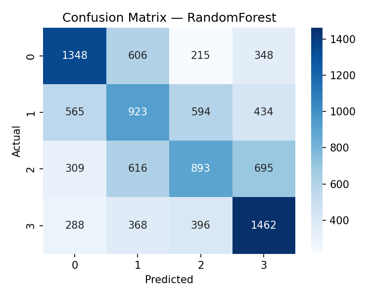
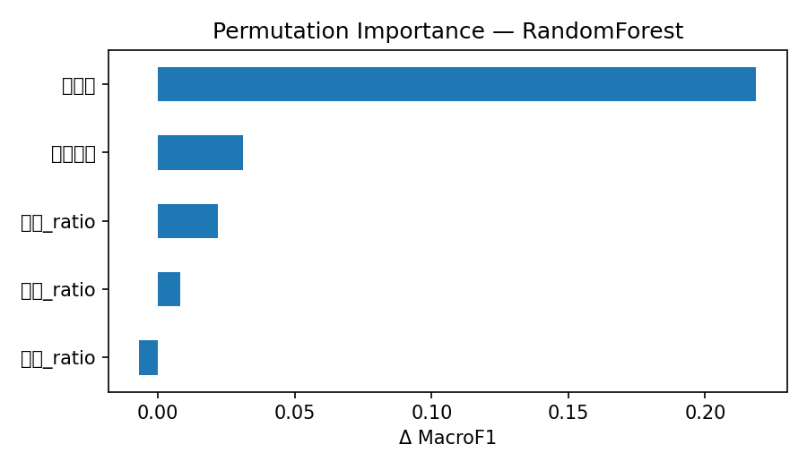

# 서울 지하철 혼잡도 Cold-start 예측

> 운행 데이터(승하차·열차) 없이 **토지이용 구조 + 시간대 + 방향**만으로 지하철 혼잡도를
> 예측하고, 그 신호가 **다른 노선으로 일반화되는지** 6가지 방법으로 검증한 cold-start 프로젝트.

핵심 질문은 "성능을 얼마나 높일까"가 아니라 **"역사 데이터가 없을 때 토지구조만으로 혼잡도를
어디까지 설명할 수 있는가"** 라는 정보 천장(information ceiling) 규명입니다.

---

## TL;DR — 핵심 결론

> **정적 행정동 토지신호는 시간 효과 위에 혼잡도 정보를 사실상 더하지 못한다(증분 R² ≈ +0.01).
> cold-start 혼잡도 예측에는 시간가변 데이터(시간대별 생활인구·OD 통근 flow)가 필수다.**

분류·회귀 두 태스크, 5가지 타깃 정의, 8개 노선에서 결론이 동일 → 모델·타깃 선택의 우연이 아닌
**데이터 구조에서 비롯된 천장**임을 입증.

---

## 결과 요약

### 1) 분류 (혼잡도 4등급, pooled qcut · nested CV · 8개 노선)

| 모델 | Macro F1 | Accuracy | MAE | 비고 |
|---|---|---|---|---|
| Logistic Regression | 0.271 | 0.296 | 1.13 | 선형 baseline |
| **Random Forest** | **0.457** | **0.460** | **0.80** | **메인** (치명오차 0↔3 = 6.3%) |
| LightGBM | 0.446 | 0.449 | 0.82 | RF와 동급 → 데이터 천장의 신호 |

### 2) 회귀 (혼잡도 실제값, 0~100 스케일 · nested CV)

| 모델 | R² | MAE | RMSE |
|---|---|---|---|
| Ridge | 0.020 | 16.7 | 22.2 |
| **Random Forest** | **0.299** | **13.9** | **18.7** |
| LightGBM | 0.230 | 14.6 | 19.6 |

R² 0.30은 "토지가 잘 맞힌다"가 아니라 **거의 전부 시간대가 만든 설명력**입니다(아래 ablation).

### 3) 토지신호의 증분 기여 — 6각도 교차검증

| 검증 방법 | 토지 기여 | 판정 |
|---|---|---|
| 분류 ablation (시간 vs +토지) | **+0.022** F1 | 미미 |
| **회귀 ablation (R²)** | 0.289 → 0.299 = **+0.010** | ≈0 |
| Permutation importance | 토지 3개 합 ≈ +0.02 (관광 −0.007) | ≈0 |
| Leave-One-Line-Out (8노선) | 평균 **−0.016** (5/8 음수) | transfer 안 됨 |
| Detrend 타깃 (시간효과 제거 잔차) | 토지 only ≈ 0.25 (랜덤) | 신호 없음 |
| 역 집계(고정) 타깃 | 토지 only ≈ 0.25~0.29 | 신호 없음 |

→ 서로 다른 6가지 방법이 한 결론을 가리킴: **토지는 시간 위에 정보를 더하지 못한다.**

### 4) Feature Importance — impurity vs permutation

```
impurity     : 시간대 0.41 | 직장 0.22 | 주거 0.19 | 관광 0.12 | 상하구분 0.06
permutation  : 시간대 0.22 | 상하구분 0.03 | 직장 0.02 | 주거 0.01 | 관광 -0.01
```

impurity는 토지 ratio를 0.2대로 과대평가하지만, 누수 없는 permutation에선 ≈0으로 추락.
이 격차 자체가 **impurity importance의 고카디널리티·연속 피처 편향**을 보여주는 방법론적 발견.

 

---

## 방법론

**데이터**
- 토지이용: 서울 상권분석서비스 — 행정동별 주거(상주)·직장·관광(길단위) 인구
- 타깃: 서울교통공사 분기별 역사 혼잡도 (2025 Q1–Q4, 평일), 8개 노선
- 공간: 지하철역 좌표 + 행정동 경계(2017)

**피처 — catchment 토지 ratio (250m)**
- 역 반경 250m 내 행정동 인구를 **면적가중 합산** → 단일 동 할당의 *경계 역 오배정* 제거
- 예: 강남역 = 역삼1동 48% + 서초4동 26% + 서초2동 26%
- 전역 min-max 후 합=1 정규화 (노선 간 비교 가능)
- 최종 피처: `상하구분`, `시간대`, `주거_ratio`, `직장_ratio`, `관광_ratio`

**누수 차단 (핵심)**
- `StratifiedGroupKFold(group = 노선_역명)` — 같은 역이 train/test 양쪽에 못 들어감
- 식별자(역번호·행정동) 피처 제외, 그룹 키로만 사용
- 호선 인코딩 통일(`2` ↔ `2호선` 분리 누수 방지)

**튜닝 — Nested Cross-Validation**
- 바깥(성능 추정) / 안쪽(하이퍼파라미터 선택)으로 **선택 편향 제거**, 안쪽도 그룹-aware
- `RandomizedSearch` 로 LR·RF·LightGBM(분류) / Ridge·RF·LightGBM(회귀) 공정 튜닝

---

## 레포 구조

```
.
├── README.md
├── requirements.txt
├── pipeline.py                    # 분류+회귀+EDA+일반화 전체 (#%% 셀)
├── make_catchment_weights.py      # GIS: 좌표+경계 → catchment 가중치 (#%% 셀)
├── data/
│   ├── station_catchment_weights.csv   # GIS 산출물 (제공)
│   └── raw/                             # 원본 데이터 (용량/라이선스상 미포함)
└── artifacts/                     # metrics.json, 모델, 그림 (자동 생성)
```

## 실행

```bash
pip install -r requirements.txt
python pipeline.py        # 또는 노트북에서 #%% 셀 단위 실행
```
1. `data/station_catchment_weights.csv` 제공됨 (재생성은 `make_catchment_weights.py`)
2. 원본 데이터를 `data/raw/` 에 배치하고 `pipeline.py` 의 `DATA_DIR` 확인
3. 결과는 `artifacts/` 에 저장 (`metrics.json`, `regression_metrics.json`, 모델, 그림)

---

## 한계와 향후 방향

정적 행정동 인구는 **시간축이 없어** 혼잡도의 시간 변동을 설명 못 함 — 이것이 cold-start 본질.
천장 돌파에 필요한 데이터(영향 순):

1. **시간대별 생활인구** (행정동×시간대 추정 체류인구) — cold-start 정신 유지하며 정적성을 깰 유일한 길
2. **OD 통근 flow** (시간×방향 수요) — 혼잡도 정의에 가장 근접, 최고 영향
3. **역 구조 피처** (환승·출구 수) — 정적이나 역간 변별력은 토지보다 강함

> 토지 *파생* 피처(연령·가구유형 등)는 같은 정적 성격의 재표현이라 효과 없음을 본 프로젝트가 ablation 으로 확인.

---

## 데이터 출처

서울 열린데이터광장(상권분석서비스·행정동 경계), 서울교통공사(혼잡도·역사 좌표)
